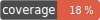

### Project
Creation of a framework in order to put into practice the TUs and the SOLID principles

[](https://htmlpreview.github.io/?https://github.com/qamar-h/QHFram/blob/code-coverage/core/tests/html/index.html)


### Start the application

```bash
bin/run
```


### Start the tests

```bashg
bin/phpunit
```


